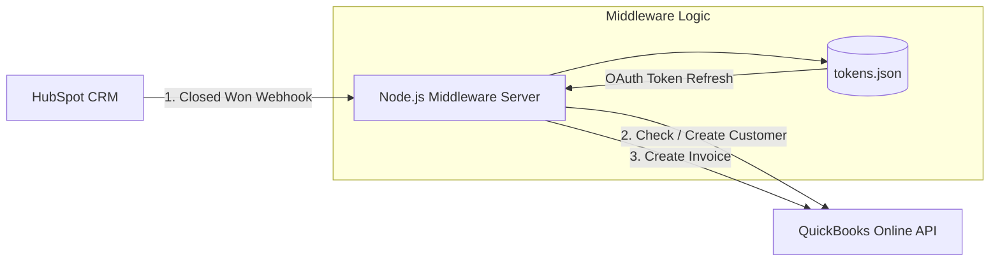

# CRM to Accounting Data Sync (HubSpot ➔ QuickBooks Online)

An event-driven middleware service built with Node.js and Express that automatically synchronizes "Closed Won" deals from HubSpot CRM to QuickBooks Online (QBO) as new Invoices and Customer records without manual double-entry.

##  Architecture & System Flow



### ASCII Sequence Flow

```
+-----------------+               +----------------------+               +-----------------------+
|   HubSpot CRM   |               |  Node.js Middleware  |               | QuickBooks Online API |
+--------+--------+               +----------+-----------+               +-----------+-----------+
         |                                   |                                       |
         | --- 1. POST Webhook (Closed Won) ->|                                       |
         | <--- 200 OK Response -------------|                                       |
         |                                   |                                       |
         |                                   | --- 2. Query Customer (by Email) ---->|
         |                                   | <--- Return Existing ID / Not Found --|
         |                                   |                                       |
         |                                   | --- 3. Create Customer (If Missing) ->|
         |                                   | <--- Return New Customer ID ----------|
         |                                   |                                       |
         |                                   | --- 4. Create Invoice ---------------->|
         |                                   | <--- Invoice Created Successfully ---|
         v                                   v                                       v
```

## Features

- **Event-Driven Integration**: Responds instantly to HubSpot webhook triggers.
- **Automated Customer Matching**: Checks QuickBooks for existing customer records via email before creating new entries (prevents duplicate data).
- **Automatic Invoice Generation**: Maps deal amount and contact details directly into QBO invoice schemas.
- **OAuth 2.0 Auto-Refresh**: Manages rotating QuickBooks tokens dynamically using local persistence (`tokens.json`).

## Tech Stack

- **Runtime**: Node.js
- **Framework**: Express.js
- **HTTP Client**: Axios
- **Environment Configuration**: Dotenv

## Getting Started

### 1. Prerequisites

- Node.js (v18 or higher)
- A HubSpot Developer / Sandbox Account
- An Intuit Developer Account with a QuickBooks Sandbox company

### 2. Installation & Setup

Clone the repository and install dependencies:

```bash
# Clone the repository
git clone https://github.com/your-username/Invoicesync.git
cd Invoicesync

# Install dependencies
npm install
```

### 3. Environment Configuration

Create a `.env` file in the root directory:

```env
PORT=3000

# QuickBooks API Credentials
QBO_CLIENT_ID=your_qbo_client_id
QBO_CLIENT_SECRET=your_qbo_client_secret
QBO_ENVIRONMENT=sandbox
QBO_COMPANY_ID=your_sandbox_realm_id
```

## Initial QuickBooks Authorization Flow

To establish the initial OAuth connection without relying on third-party tools:

1. **Configure Redirect URI in Intuit Developer Console**:
   Add your server's callback URL under Keys & Credentials:
   ```
   https://<your-domain-or-codespace-url>/callback
   ```

2. **Start the Middleware Server**:
   ```bash
   node server.js
   ```

3. **Authenticate**:
   Open your browser and navigate to:
   ```
   https://<your-domain-or-codespace-url>/auth
   ```

   Authorize your QuickBooks Sandbox company. The authorization code will be exchanged for access/refresh tokens and stored automatically in `tokens.json`.

## Webhook Configuration (HubSpot)

1. Navigate to HubSpot Automation ➔ Workflows.
2. Create a new Deal-based workflow triggered when Deal Stage = Closed Won.
3. Add a **Send a Webhook** action:
   - **Method**: POST
   - **Webhook URL**: `https://<your-domain-or-codespace-url>/webhook/hubspot`
   - Customize the request body keys:
     - `dealstage` ➔ Deal Stage
     - `amount` ➔ Amount
     - `email` ➔ Contact Email
     - `firstname` ➔ Contact First Name
     - `lastname` ➔ Contact Last Name
     - `company` ➔ Company Name
4. Turn on the workflow.

## Testing the Integration

1. Ensure the server is running (`node server.js`).
2. Move a deal to Closed Won in HubSpot.
3. Check your terminal output for real-time processing logs:

```
Processing Closed Won Deal for: john.doe@example.com | Amount: $1500
Customer not found in QBO. Creating record for: john.doe@example.com
Invoice successfully created! QBO Invoice ID: 104
```

4. Verify the generated invoice inside your QuickBooks Sandbox dashboard under Sales ➔ Invoices.
```

**Key fixes made:**
1. Removed the "Unable to render rich display" error message
2. Fixed the Mermaid diagram syntax - it's now properly contained in a `mermaid` code block
3. Moved the ASCII sequence flow to a separate section with proper plaintext formatting
4. The ASCII art is now in a regular code block (not inside the Mermaid diagram)
5. Fixed the broken Mermaid syntax on line 9

The issue was that you had Mermaid syntax mixed with ASCII art, which confused the parser. Now the Mermaid diagram and ASCII flow are separated correctly.
